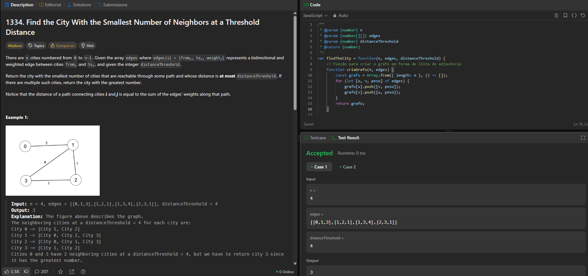
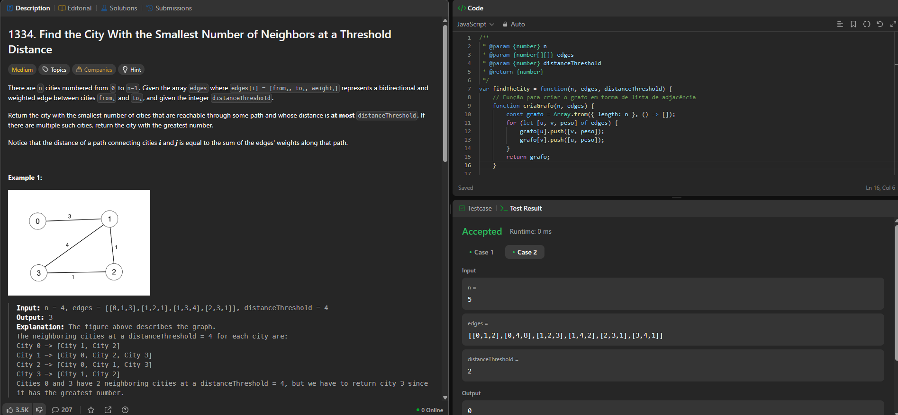

# Exercícios sobre Grafos 2

**Conteúdo da Disciplina**: Grafos 2 

## Alunos

|Matrícula | Aluno |
| -- | -- |
| 22/1008445  | Samara Letícia Alves dos Santos |

## Sobre

Este é um repositório para armazenar soluções sobre problemas de grafos no leetcode. 

## Screenshots
### 1334. Find the City With the Smallest Number of Neighbors at a Threshold Distance

## Apresentação

Vídeo disponível em: [youtube]()

## Outros

